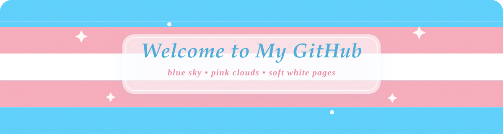

  

<h1 align="center">୨୧ Hi, I'm 小花凉ovo ୨୧</h1>

  🌸 欢迎来到我的 GitHub 小角落 🌸  
  ✨ 正在慢慢发光，也在认真长大 ✨

  
  
  

  ⋆｡˚ 🌷 🫧 💙 ☁️ ✨ ˚｡⋆

---

## ♡ About Me

- 🌷 你好呀，我是 `小花凉ovo`
- 🎀 目前身份：`学生`
- 💻 正在学习：`时间序列分析 rust 还有一些其他的东西`
- ✨ 喜欢把灵感一点点变成现实
- 🍓 希望写出温柔又有力量的代码

## ♥ Something I Love

- 🌸 the character of 《bang dream! ave mujica》 called Togawa Sakiko
- 🌸 夏恋
- 🌸 ice cream
- 🌸 还有很多很多

## ♡ A Tiny Note

> “慢一点也没关系，只要一直在往前走呀。”  
> “Still growing, still glowing.”  
> "you are not alone"

  pink mood × blue breeze × tiny progress every day

---

  🍰 Thanks for visiting my profile 🍰  
  希望你今天也有一点点开心 ♡

